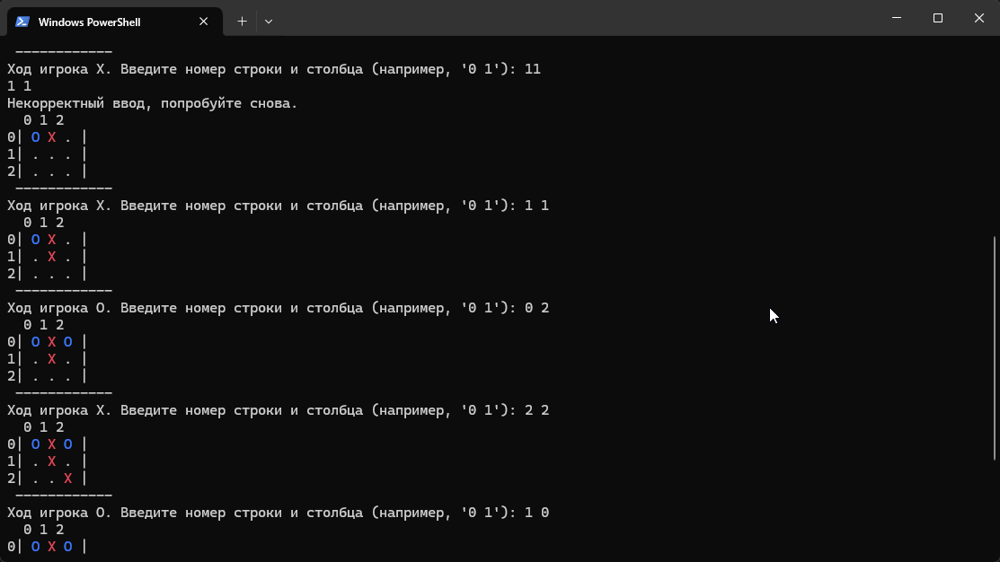

# GolangTicTacToe by VechniyRabotnnik

## This code was made with the help of guides for self-learning purposes! / Данный код был сделан с помощью гайдов в целях самообучения!

## Info/Информация

# English

This code works in the bash or Powershell console. This is a simple tic tac toe game

# Russian

Этот код работает в консоли bash или Powershell. Это простая игра в крестики-нолики.
